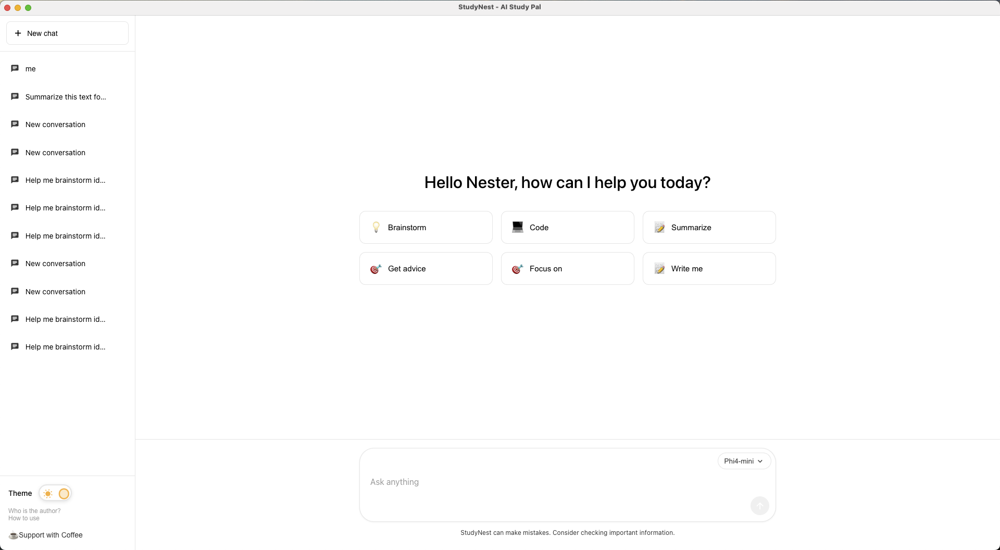
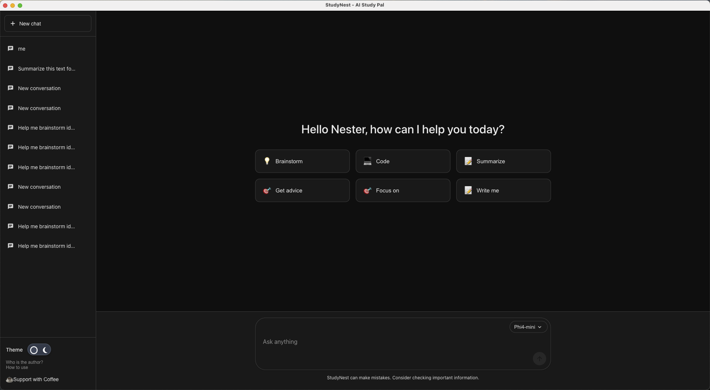

# StudyNest

An AI-powered study assistant desktop application that runs locally with privacy-first design. Built with Electron, React, and TypeScript.

## Demo

<div align="center">
  
  
</div>

## Why StudyNest over Ollama PC App?

StudyNest offers several advantages over the standard Ollama desktop application:

- **Study-Focused Interface** - Purpose-built UI optimized for learning and research, not just generic chat
- **Modern UX Design** - Beautiful, responsive interface with seamless light/dark theme switching
- **Smart Prompt Suggestions** - Quick-start templates tailored for studying, research, and learning tasks
- **Enhanced Conversation Features** - Rename conversations, better organization, and local database storage
- **Optimized Performance** - React-based UI with smooth animations and real-time updates
- **Customizable & Extensible** - Open architecture for adding study-specific features

**Want more features?** Create an issue and I'll work on implementing your requests!

## Features

### 1. AI Chat Interface

- ChatGPT-like conversational interface
- Support for local Small Language Models (SLM)
- Offline-first architecture for complete privacy
- Real-time message streaming
- Conversation history management

### 2. Modern Design System

- Light and dark theme support with seamless switching
- Material Design Icons integration
- Responsive and accessible UI components
- Custom design tokens for consistent styling

### 3. Privacy-Focused

- All data stays on your device
- No external API calls required
- Local LLM integration ready
- Secure document management

### 4. Chat Features

- Multiple conversation threads
- Message history with timestamps
- Typing indicators
- Prompt suggestions for quick start
- Auto-resizing text input

## Prerequisites

### Required
- **Node.js** (v18 or higher)
- **pnpm** (recommended) or npm
- **Rust toolchain** (for Crane service)

### Optional
- **Ollama** (if you want to use Ollama models instead of Crane)

## Installation

### 1. Install Dependencies

```bash
# Install Node.js dependencies
pnpm install
```

### 2. Install Rust (for Crane Service)

```bash
# Install Rust toolchain
curl --proto '=https' --tlsv1.2 -sSf https://sh.rustup.rs | sh

# Verify installation
rustc --version
cargo --version
```

### 3. Download AI Models

StudyNest uses local AI models. You need to download at least one model:

#### Option A: Download Crane Models (Recommended)

```bash
# Install huggingface-cli
pip install huggingface-hub

# Download Qwen 2.5 (0.5B) - Fast, lightweight
huggingface-cli download Qwen/Qwen2.5-0.5B-Instruct \
  --local-dir crane-studynest/checkpoints/Qwen2.5-0.5B-Instruct

# Or download Qwen 2.5 (1.5B) - Better quality
huggingface-cli download Qwen/Qwen2.5-1.5B-Instruct \
  --local-dir crane-studynest/checkpoints/Qwen2.5-1.5B-Instruct
```

**Model Requirements:**
- Qwen2.5-0.5B: ~1GB download, ~2GB RAM
- Qwen2.5-1.5B: ~3GB download, ~4GB RAM
- Qwen2.5-3B: ~6GB download, ~8GB RAM

#### Option B: Use Ollama Models

```bash
# Install Ollama from https://ollama.ai
# Then pull a model
ollama pull phi4-mini
ollama pull tinyllama
```

## Development

### Running in Development Mode

```bash
pnpm run dev
```

**What happens:**
1. Rust service is automatically compiled (first time takes ~2-3 minutes)
2. React dev server starts on port 3000
3. Electron app launches
4. Models are detected from `crane-studynest/checkpoints/`

### First Run

On first run, you'll see:
- Rust compilation logs (one-time setup)
- Model detection in console
- Available models in the dropdown

**Select a model:**
- Crane models: `Qwen 2.5 (0.5B) Instruct (988 MB)`
- Ollama models: `Phi4 Mini Latest`, `Tinyllama 1.1B`

### Building for Production

```bash
pnpm run build
```

### Packaging

Build distributable packages for your platform:

```bash
# For macOS
pnpm run package:mac

# For Windows
pnpm run package:win

# For Linux
pnpm run package:linux

# For all platforms
pnpm run package
```

## Project Structure

```
studynest/
├── electron/              # Electron main process
│   ├── main.ts           # Main process entry point
│   └── preload.ts        # Preload script for IPC
├── src/
│   ├── components/       # Reusable UI components
│   │   ├── Button/       # Button component with variants
│   │   ├── Card/         # Card container component
│   │   ├── ChatInput/    # Message input with actions
│   │   ├── ChatMessage/  # Message display component
│   │   ├── Input/        # Form input component
│   │   ├── Sidebar/      # Navigation sidebar
│   │   ├── ThemeToggle/  # Light/dark theme switcher
│   │   └── Typography/   # Text components
│   ├── hooks/            # Custom React hooks
│   │   ├── useChat.ts    # Chat state management
│   │   └── useTheme.ts   # Theme management
│   ├── screens/          # Main application screens
│   │   ├── Chat/         # Chat interface screen
│   │   └── Home/         # Home screen
│   ├── styles/           # Global styles and tokens
│   │   ├── tokens.css    # Design system tokens
│   │   └── README.md     # Design system documentation
│   ├── types/            # TypeScript type definitions
│   │   ├── chat.ts       # Chat-related types
│   │   └── task.ts       # Task-related types
│   ├── utils/            # Utility functions
│   │   └── llm.ts        # LLM client for local models
│   ├── App.tsx           # Root component
│   ├── index.tsx         # React entry point
│   └── index.css         # Global styles
├── public/               # Static assets
│   └── index.html        # HTML template
├── dist/                 # Build output
└── release/              # Packaged applications
```

## Technologies

### Core

- **Electron** (v28.3.3) - Desktop application framework
- **React** (v18.3.1) - UI library
- **TypeScript** (v5.9.3) - Type-safe JavaScript

### UI & Styling

- **Material Design Icons** (@mdi/react, @mdi/js) - Icon library
- **CSS Variables** - Design tokens system

### Build Tools

- **Webpack** (v5.104.1) - Module bundler
- **electron-builder** - Application packager
- **pnpm** - Fast, disk space efficient package manager

## Local LLM Integration

StudyNest supports two methods for running local LLMs:

### Option 1: Crane Service (Recommended - Built-in)

StudyNest includes a built-in Rust-based service using the Crane framework for running LLM models locally without external dependencies.

#### Prerequisites
- Rust toolchain installed: `curl --proto '=https' --tlsv1.2 -sSf https://sh.rustup.rs | sh`
- Download a Qwen model from HuggingFace:

```bash
# Install huggingface-cli
pip install huggingface-hub

# Download a model (choose one)
huggingface-cli download Qwen/Qwen2.5-0.5B-Instruct --local-dir crane-studynest/checkpoints/Qwen2.5-0.5B-Instruct
huggingface-cli download Qwen/Qwen2.5-1.5B-Instruct --local-dir crane-studynest/checkpoints/Qwen2.5-1.5B-Instruct
```

#### How It Works
The Crane service is automatically built and integrated when you run:

```bash
# Development mode
pnpm run dev
# Automatically builds Rust service → starts app

# Production build
pnpm run package
# Builds Rust service → packages everything together
```

**Build Process:**
1. `build:rust:dev` script compiles the Rust service in release mode
2. Binary is copied to `dist/bin/chat-service`
3. If build fails, app falls back to using `cargo run` (slower but works)
4. Service starts automatically when app launches

**Manual Build:**
```bash
# Build Rust service separately
pnpm run build:rust:dev

# Or build for production
pnpm run build:rust
```

**Supported Models:**
- Qwen2.5-0.5B-Instruct (fast, 1-2GB RAM)
- Qwen2.5-1.5B-Instruct (balanced, 3-4GB RAM)
- Qwen2.5-3B-Instruct (high quality, 6-8GB RAM)
- Qwen3-0.6B / Qwen3-1.7B (latest models)

**Performance:**
- **macOS (Apple Silicon)**: Metal GPU acceleration (3-5x faster)
- **NVIDIA GPUs**: CUDA support (build with `--features cuda`)
- **CPU**: Works everywhere, slower but functional

**Advantages:**
- ✅ No external server needed (Ollama not required)
- ✅ Faster startup and response times
- ✅ Better integration with Electron
- ✅ Smaller footprint
- ✅ Full control over model lifecycle

### Option 2: External LLM Server (Ollama, LM Studio)

You can also connect to external LLM servers:

1. Start your local LLM server (e.g., Ollama, LM Studio, llama.cpp)
2. Update the LLM endpoint in `src/hooks/useChat.ts`
3. Configure the model settings in `src/utils/llm.ts`

Example endpoints:
- **Ollama**: `http://localhost:11434/api/generate`
- **LM Studio**: `http://localhost:1234/v1/chat/completions`

## Troubleshooting

### Rust Service Issues

**"crane-studynest directory not found"**
```bash
# Make sure you're in the project root
cd /path/to/StudyNest
ls crane-studynest  # Should show the directory
```

**"cargo: command not found"**
```bash
# Install Rust
curl --proto '=https' --tlsv1.2 -sSf https://sh.rustup.rs | sh
source $HOME/.cargo/env
```

**"Model not found" or "Failed to initialize model"**
```bash
# Verify model files exist
ls crane-studynest/checkpoints/Qwen2.5-0.5B-Instruct/
# Should show: config.json, model.safetensors, tokenizer files

# Re-download if needed
huggingface-cli download Qwen/Qwen2.5-0.5B-Instruct \
  --local-dir crane-studynest/checkpoints/Qwen2.5-0.5B-Instruct
```

**Slow inference or timeout**
- First inference takes longer (model loading)
- Subsequent responses are faster
- On Apple Silicon, Metal GPU acceleration is automatic
- Check Activity Monitor for memory usage

**"Request timeout"**
- Model initialization can take 1-2 minutes first time
- Check console logs for errors
- Ensure you have enough RAM (2GB+ free)

### Ollama Issues

**"Failed to fetch ollama models"**
```bash
# Check if Ollama is running
ollama list

# Start Ollama service
ollama serve
```

## Performance Tips

### For Crane Models
- **Apple Silicon (M1/M2/M3)**: Automatic Metal GPU acceleration (3-5x faster)
- **Intel Mac**: Uses CPU, slower but works
- **First run**: Model loading takes 30-60 seconds
- **Subsequent runs**: Responses in 1-5 seconds

### Memory Usage
- Keep Activity Monitor open to monitor RAM
- Close other apps if running large models
- Use smaller models (0.5B) on machines with <8GB RAM

## Design System

StudyNest includes a comprehensive design system with:

- Color scales (white/black with opacity variants)
- Primary colors (blue shades)
- Spacing scale (4px to 64px)
- Typography system
- Reusable components (Button, Input, Card, Typography)

See `src/styles/README.md` for detailed documentation.

## Contributing

Contributions are welcome! Please feel free to submit a Pull Request.

## License

MIT
